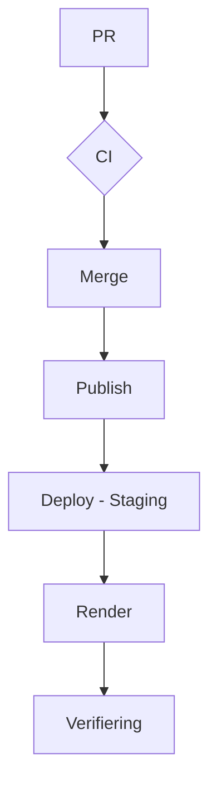

# Deploy – Kraftly Mina sidor

## Flödet

(Mermaid-diagram: PR → CI → merge → publish → deploy-staging → Render → verifiering)

## Miljöer

| Miljö            | URL                                          | Image                                   | API                                      | Uppdateras                    |
| ---------------- | -------------------------------------------- | --------------------------------------- | ---------------------------------------- | ----------------------------- |
| Utveckling (Dev) | `https://kraftly-volt-staging.onrender.com/` | http://ghcr.io/falusvampen/kraftly:main | https://kraftly-api-staging.onrender.com | Automatisk via Github Actions |

## Konfiguration – var bor vad?

| Variabel             | Hemlig? | Lokalt                    | Staging                          | Används av                      |
| :------------------- | :------ | :------------------------ | :------------------------------- | :------------------------------ |
| `API_KEY`            | Ja      | Unik lokal nyckel / Mock  | Unik staging-nyckel              | Backend / Externa integrationer |
| `API_URL`            | Nej     | `http://localhost:PORT`   | URL till staging-API:et          | Frontend / Klientapplikationer  |
| `PORT`               | Nej     | T.ex. `4000` eller `8080` | Sätts dynamiskt av hosten        | Applikationsserver (Backend)    |
| `RENDER_DEPLOY_HOOK` | Ja      | Ej aktiv / Lämnas tom     | URL i plattformens inställningar | CI/CD (t.ex. GitHub Actions)    |
| `STAGING_URL`        | Nej     | Ej aktiv / Lämnas tom     | Den publika staging-adressen     | Frontend / CORS / E-postmallar  |
| `GITHUB_TOKEN`       | Ja      | Personlig PAT (vid behov) | GitHub Actions Secret            | CI/CD / GitHub API-anrop        |

## API-nyckeln

Vad hände med den gamla, varför den är död (curl-utskriften med 401), var den nya ligger.
Skrev ni om historiken? Varför / varför inte?

Den gamla API-nyckeln har spärrats (leder ingenstans) eftersom den av misstag råkade checkas in i kodbasen.
Om du försöker använda den gamla nyckeln kommer du att få ett 401 Unauthorized-felmeddelande i din curl-utskrift.
Vi valde att inte skriva om Git-historiken eftersom den gamla nyckeln redan är permanent spärrad och helt ogiltig hos leverantören. Att skriva om historiken i efterhand skapar ofta onödigt strul med merge-konflikter för alla i teamet. Den gamla nyckeln är numera bara en helt obrukbar textsträng.
Den nya ligger hos Render.

## Rollback

Två sätt, steg för steg. Hur ni kontrollerar att det lyckades.

1.Rollback i Render, manuellt:

- Logga in på Render.
- Gå till dashboard.
- Besök vår url och lägg till versions.txt
- Då får vi upp vår sha.
- Kontrollera SHA-hashen: Verifiera att den Git-SHA som visas på sidan matchar den stabila versionen som du precis rullade tillbaka till.

## Tider (uppmätta)

| Steg | Tid |
(merge → publish klar · hook → rätt sha svarar · totalt · kallstart)

## Kända begränsningar

(kallstart, vem som äger Render-kontot, arm64 vs amd64, ingen prod ännu)

Kallstart: Ja, eftersom vi använder en gratisnivå så går den ner i viloläge vid inaktivitet. Det innebär att den första förfrågan efter en tids uppehåll kommer att drabbas av en fördröjning (kallstart) medan instansen snurrar igång igen.

Konto: Louise äger Render-kontot, Tech-lead för denna period.

Arm64 vs amd64: Renders byggmiljö körs på AMD64-arkitektur, Louise sitter på en MAC med arm64 och övriga på amd64

## Screenshot

