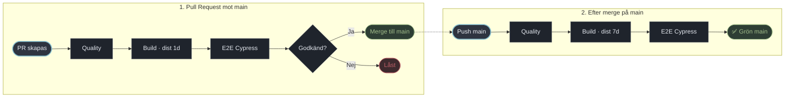

# Pipeline – Kraftly Mina sidor

## Flöde

## Beslut 1 · Jobb: parallellt eller i serie?

### Vi har valt en sekventiell seriekoppling med fail-fast-arkitektur (quality ➔ build ➔ e2e).

#### Varför?

- Fail-fast: Här kör vi en snabb quality check med vår linting, formatering och unit tests. Om linting eller enhetstester failar så avbryts pipelinen direkt. Dyrare jobb startas aldrig.

- Single Source of Truth: build kompilerar koden till /dist. Denna artefakt laddas sedan ner av e2e-jobbet, vilket garanterar att Cypress testar exakt den produktions-bundle (vite preview) som skeppas utan att appen behöver byggas två gånger.

#### Tid vs kostnad

- Parallellkörning hade sänkt den totala väntetiden ifall om allt passerar, men kostar fler parallella GitHub Actions-minuter vid fel (eftersom tunga Cypress-maskiner hinner starta innan ett syntaxfel i linten upptäckts).

- Seriekopplingen ger snabbast möjlig felrapportering på slarvfel och minimerar förbrukade runner-minuter.

## Beslut 2 · Vad krävs för merge?

För att en PR ska kunna mergas till main gäller följande regler via GitHub Branch Protection:

- Required Status Checks:

  - Code Quality (Lint, Format, Unit Tests)

  - Build Verification

  - E2E Tests (Cypress)

- Require branches to be up to date before merging: Ja. Koden i PR:en måste vara omtestad mot senaste versionen av main innan den får slås ihop.

- Approvals: Minst 1 godkänd review från en teammedlem krävs.

- Bypass: Ingen bypass är tillåten (reglerna gäller även repository-admins för att garantera spårbarhet och stabilitet).

## Beslut 3 · Protokoll vid röd main

Workflowet körs om i sin helhet direkt vid push till main för att verifiera att sammanslagningen inte introducerade oväntade fel.

Men om main mot förmodan blir röd (t.ex. vid beroendeuppdatering eller oväntad integrationskrock):

1. Stoppa intag: Inga nya PR:er får mergas förrän main är grön igen.

2. Ansvar: Utvecklaren vars merge orsakade felet äger frågan och påbörjar felsökning omedelbart (inom 15 minuter).

3. Revert vs. Laga framåt:
   - Revert (Standard): Om felet inte är lokaliserat och åtgärdat inom 15 minuter, görs en omedelbar git revert av den felande committen direkt mot main.

   - Laga framåt: Tillåts endast om det rör sig om en trivial "one-liner" (t.ex. en saknad miljövariabel eller ett uppenbart konfigurationsfel) som kan verifieras och mergas direkt.

   - Inga genvägar: Inga tvingade pushar (--force) eller avstängda checks får användas för att "runda" problemet.

## Övrigt

1. Vi styr retention för bygget dynamiskt via uttrycket: `${{ github.ref == 'refs/heads/main' && 7 || 1 }}:`

   - PR (1 dag): I en PR genereras /dist enbart för att temporärt skickas vidare till e2e-jobbet i samma körning. Den har inget värde efter att testerna passerat och städas därför bort efter 1 dygn för att spara lagringskvot.

   - Main (7 dagar): När koden landar på main representerar artefakten en verifierad produktions-bundle. Den sparas i 7 dagar för manuell nedladdning, releaseverifiering eller rollback-historik.

2. Vi har en trigger där man kan köra med eller utan npm cache (ganska onödigt men lite kul lol)

## Byggtid: före och efter npm-cache

| Steg             | Utan cache | Med cache |
| ---------------- | ---------- | --------- |
| npm ci (quality) |            |           |
| npm ci (build)   |            |           |
| Hela körningen   |            |           |

Skärmdumpar: …

## Skärmdump linting och

## Skärmdump: låst merge-knapp

…
